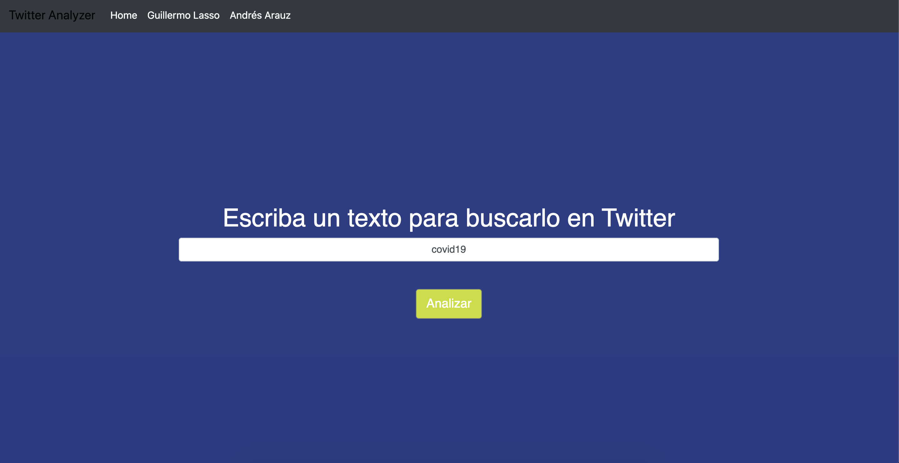
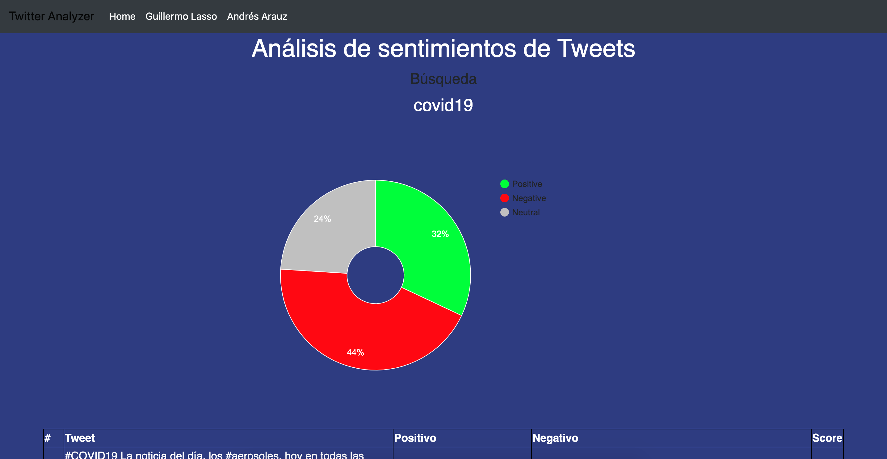

# AnalisisDeSentimientosTwitter

 

Análisis de sentimientos a partir de Tweets usando AFINN-ES-165
 
Se puede buscar cualquier texto que se desee en español o usar las búsquedas por defecto de los candidatos presidenciales de Ecuador.

 
 

# Para hacer funcionar el proyecto
1. Crear cuenta de desarrollador en Twitter en https://developer.twitter.com/en/apps
2. Renombrar el archivo config/properties.json.example a config/properties.json
3. Actualizar el archivo config/properties.json. con las credenciales obtenidas en la cuenta de desarrollador de twitter
4. npm install
5. npm start
6. Por defecto el proyecto funcionará en la siguiente ruta: http://localhost:3000/

 
 

 
 
 
